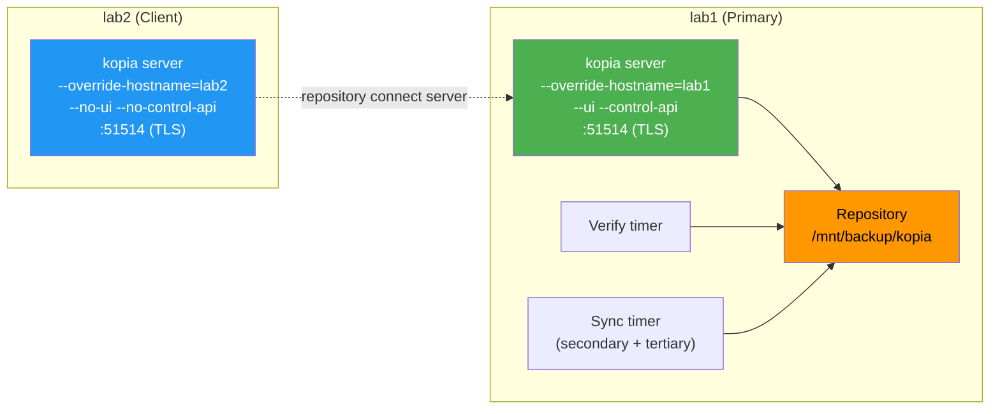

# Migrate Kopia server from Docker to native binary

## Motivation

Kopia server runs as a Docker container. The kopia binary supports running
as a native daemon with built-in snapshot scheduling. This eliminates Docker
for the server and replaces systemd timers on agent hosts with the built-in
scheduler.

## Architecture

Each host with backups runs its own `kopia server` instance. The server's
built-in scheduler only triggers snapshots for **local sources** — where the
source hostname matches the server's `--override-hostname`.

**Primary server (lab1):**
- Owns the repository (`repository filesystem` at `/mnt/backup/kopia`)
- Runs with full features: UI, control API, scheduler
- Manages verify + sync-to secondary/tertiary via systemd timers
- Schedules snapshots for lab1 paths (postgres, etc.)

**Client server (lab2+):**
- Connects to primary's repo via `repository connect server`
- Runs headless: `--no-ui --no-control-api`
- Scheduler triggers snapshots for lab2 paths (vaultwarden, linkwarden, etc.)
- No verify/sync — only primary manages repository maintenance

## Current state

- `kopia_server`: Docker (docker-compose), lab1 only
- `kopia_agent`: native .deb, systemd timers for snapshots, lab1+lab2
- Server manages repository, sync-to, verification
- Agents trigger snapshots via systemd timers

## Target state

Both primary and client servers run `kopia server start` via systemd.

**lab1 (primary)**

- Connect: `repository filesystem` (local repo at `/mnt/backup/kopia`)
- Config: `/opt/ansible/kopia_server/`
- TLS: step-ca cert via Ansible
- Features: UI + control API + scheduler enabled
- Verification: systemd timer (only primary runs verification)
- Sync-to secondary/tertiary: systemd timer

**lab2 (client)**

- Connect: `repository connect server` → primary on lab1
- Config: `/opt/ansible/kopia_agent/`
- TLS: step-ca cert via Ansible
- Features: `--no-ui --no-control-api` (headless scheduler only)
- Snapshots: kopia policy scheduler (`--snapshot-interval` / crontab)

## Design decisions

| Decision | Value | Rationale |
| --- | --- | --- |
| Repository location | Unchanged | Existing data stays in place |
| Installation method | .deb from GitHub | Same as current agent, consistent |
| Run as | root | Backup paths owned by root |
| Primary server | Full features (UI, control API, scheduler) | Web UI access, user management, verify/sync |
| Client server | Headless (`--no-ui --no-control-api`) | Scheduler only, no web interface needed |
| Snapshot scheduling | kopia policy (`--snapshot-interval`) | Built-in scheduler replaces systemd timers |
| Verification | systemd timer on primary | Kopia scheduler lacks verification support |
| Sync-to | systemd timer on primary | Kopia scheduler lacks sync-to support |
| TLS | step-ca cert via Ansible | Kopia lacks ACME support, step-ca already in infra |
| Roles | Two separate roles | `kopia_server` (primary), `kopia_agent` (client) |

## Implementation steps

### 1. Create `kopia_server` role (primary)

- [ ] Install native binary (.deb from GitHub)
- [ ] Create systemd service unit (`kopia-server.service`)
- [ ] Environment file for secrets (not visible in `ps aux`)
- [ ] TLS cert management via step-ca (check expiration, rotate 30-90 days)
- [ ] `server start` with full features: `--ui`, `--control-api`, `--override-hostname`
- [ ] Sync-to secondary/tertiary as systemd timers
- [ ] Verification as systemd timer

### 2. Update `kopia_agent` role (client)

- [ ] Replace systemd timers with `kopia server start` via systemd
- [ ] `server start` with headless flags: `--no-ui --no-control-api --override-hostname`
- [ ] Connect to primary repo via `repository connect server`
- [ ] Use `kopia policy set --snapshot-interval` for schedules
- [ ] Environment file for repo password and server credentials
- [ ] TLS cert management via step-ca

### 3. Update inventory

- [ ] Add `schedule` field to each `backup_sources` entry (interval format: `1h`, `2h`, `daily`, etc.)
- [ ] Add `kopia_server_url` for client connection (`https://lab1:51514`)
- [ ] Update config paths to `/opt/ansible/kopia_server/` and `/opt/ansible/kopia_agent/`

### 4. Update `servers.yml`

- [ ] Adjust role order: `kopia_server` before `kopia_agent` (client depends on primary)
- [ ] Verify tags work correctly

## Affected files

- `playbooks/roles/infra/kopia_server/` (new: native binary, primary server)
- `playbooks/roles/infra/kopia_agent/` (update: timers → headless server)
- `inventory/host_vars/lab1.yml` (add schedule to backup_sources)
- `inventory/host_vars/lab2.yml` (add schedule to backup_sources)
- `inventory/group_vars/servers.yml` (update kopia paths, add server URL)
- `docs/plans/` (this file)

## Difficulty

Hard. Full role rewrite for `kopia_server`, significant changes to `kopia_agent`, inventory updates.
