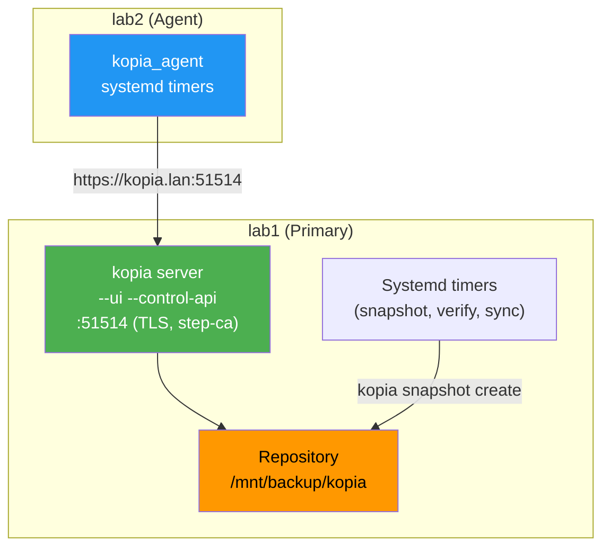

# Migrate Kopia server from Docker to native binary

## Status: Planned

## Motivation

Kopia server runs as a Docker container behind Traefik. Migrating to a native
binary eliminates Docker overhead and keeps all Kopia components as native
systemd services. The server is the same `kopia` binary as the agent — the
difference is only the systemd service command and flags.

## Architecture

**lab1 (server + agent):**
- Native `kopia server start` via systemd service
- Full features: UI, control API on `:51514`
- TLS: step-ca cert for `kopia.lan` (offline issuance via JWK key)
- Listens directly on port 51514 (no Traefik)
- Systemd timers for lab1 snapshots (same pattern as agents)
- Systemd timers for verify + sync-to secondary/tertiary

**lab2 (agent):**
- Unchanged: native .deb, systemd timers for snapshots
- Connects to lab1 server API via `https://kopia.lan:51514`

## Current state

- `kopia_server`: Docker (docker-compose), lab1 only, behind Traefik
- `kopia_agent`: native .deb, systemd timers for snapshots, lab1+lab2
- Server manages repository, sync-to, verification
- Agents trigger snapshots via systemd timers
- UI accessible at `https://kopia.lan` (Traefik → 443)

## Target state

- `kopia_server`: native systemd service, lab1 only, direct port 51514
- `kopia_agent`: unchanged
- UI accessible at `https://kopia.lan:51514`
- CNAME `kopia.lan` → lab1 stays the same

## Design decisions

| Decision | Value | Rationale |
| --- | --- | --- |
| Repository location | Unchanged | Existing data stays in place |
| Installation method | .deb from GitHub | Same as current agent, consistent |
| Run as | root | Backup paths owned by root |
| Server features | Full (UI + control API) | Web UI access, user management |
| Snapshot scheduling | systemd timers | Built-in scheduler doesn't work with server-to-server connections |
| Verification | systemd timer on lab1 | Kopia scheduler lacks verification support |
| Sync-to | systemd timer on lab1 | Kopia scheduler lacks sync-to support |
| TLS | step-ca cert via Ansible | Kopia lacks ACME support, step-ca already in infra |
| Traefik | Removed | Direct port, server handles its own TLS |
| Roles | Two separate roles | `kopia_server` (native, lab1), `kopia_agent` (unchanged, lab1+lab2) |

## Implementation steps

### 1. Rewrite `kopia_server` role (native)

- [ ] Remove Docker compose, templates, and Traefik routing
- [ ] Install native binary (.deb from GitHub, same as agent)
- [ ] Create systemd service unit (`kopia-server.service`)
- [ ] Environment file for secrets (not visible in `ps aux`)
- [ ] TLS cert management via step-ca (offline issuance with JWK key)
- [ ] `server start` with flags: `--ui`, `--control-api`, `--override-hostname`
- [ ] Keep verify + sync-to secondary/tertiary as systemd timers
- [ ] Remove `traefik` dependency from `meta/main.yml`

### 2. Keep `kopia_agent` role unchanged

- No changes needed — agents already connect to server API via HTTPS

### 3. Update inventory

- [ ] Update `kopia_server_url` to `https://kopia.lan:51514` (was behind Traefik on 443)
- [ ] Remove any Traefik-related kopia vars

### 4. Update `site.yml`

- [ ] Move `kopia_server` from `docker_services/infra/` to `os_services/`
- [ ] Update tags: `kopia_server` → `layer_os_services`
- [ ] Remove `kopia_server` dependency on `traefik`

### 5. Update documentation

- [ ] Update `README.md` — UI port change (`kopia.lan` → `kopia.lan:51514`)
- [ ] Update `AGENTS.md` — kopia_server in os_services layer

## Affected files

- `playbooks/roles/os_services/kopia_server/` (rewrite: Docker → native binary)
- `playbooks/roles/os_services/kopia_agent/` (no changes)
- `playbooks/site.yml` (move role to os_services layer)
- `inventory/group_vars/servers.yml` (update server URL)
- `README.md` (UI port change)
- `AGENTS.md` (layer documentation)
- `docs/plans/` (this file)

## Difficulty

Medium. Rewrite `kopia_server` role (Docker → native), move to `os_services` layer, update docs. Agent role unchanged.

## Rejected approaches

- **Built-in scheduler:** Kopia's built-in scheduler doesn't work with `repository connect server` (read-only mode). Systemd timers remain the scheduling mechanism.
- **Server-to-server on lab2:** Running `kopia server start` on lab2 connecting to lab1 was explored but rejected — adds complexity without benefit. Lab2 stays as an agent.
